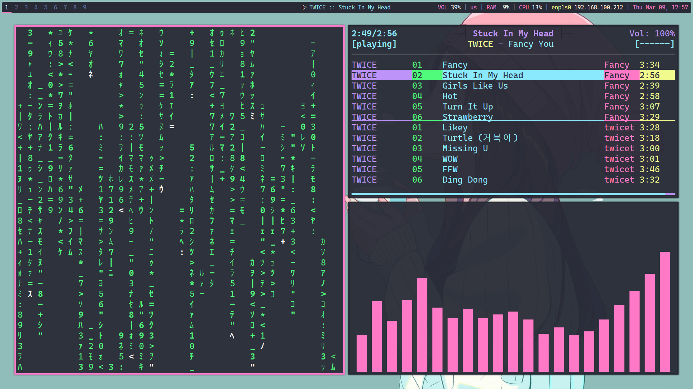
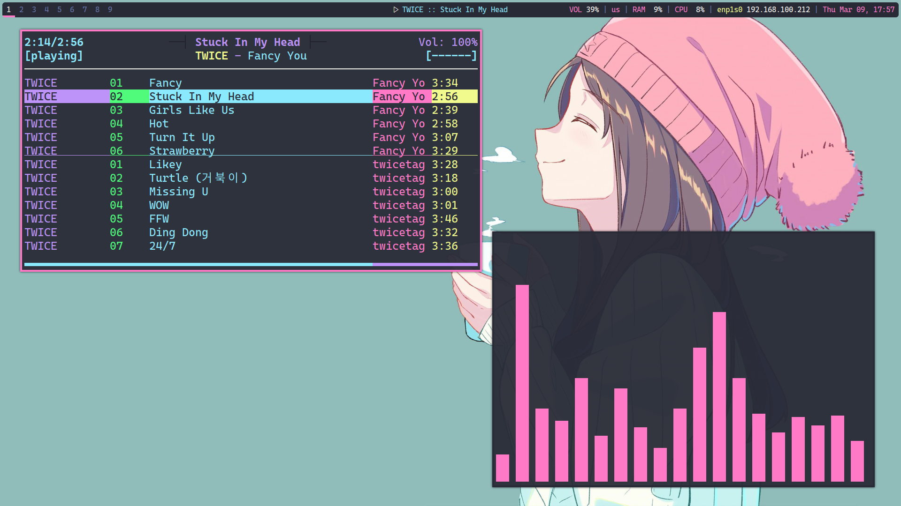
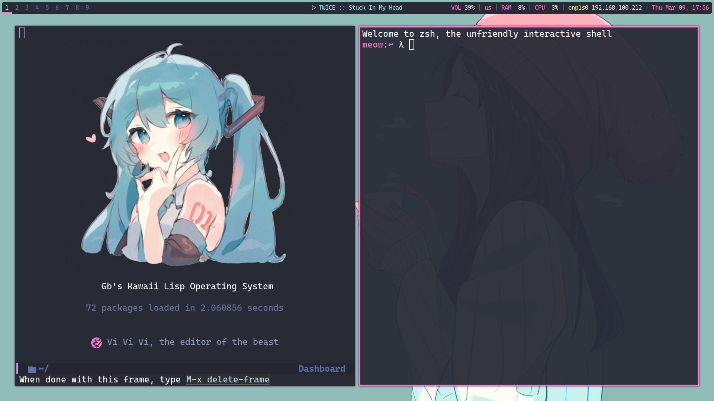
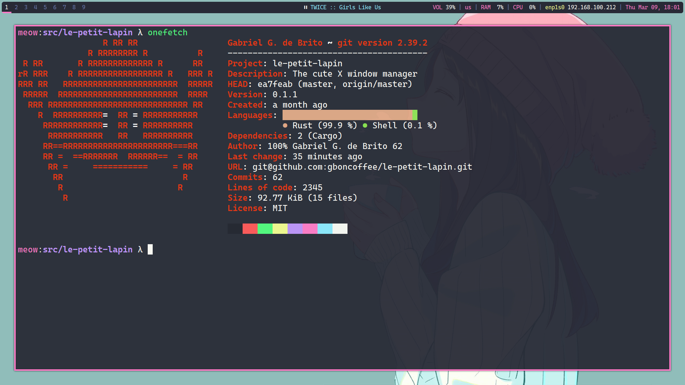

# Le Petit Lapin

Le Petit Lapin is a X window manager written in Rust as a library. One
must create a binary Cargo crate that depends on `le-petit-lapin` to
build it with a desired configuration.

The name "Le petit lapin" was choosen by a friend of mine and it means "The 
little bunny" in French, but I'm not 100% sure about that because I don't speak
French.

To use this crate, you'll need both XCB and Xlib installed.

Check other screenshots in the end of this README!

## Quickstart

To use this window manager you must have the Rust build system,
`cargo`, installed. Install it from [Rust
website](https://www.rust-lang.org/learn/get-started) or with your
operating system package manager.

Next, go/create to the directory where you want to keep your
configuration. Example:

`$ mkdir -p ~/.config/le-petit-lapin`  
`$ cd ~/.config/le-petit-lapin`

Init a new Cargo crate:

`$ cargo init`

Add `le-petit-lapin` as a dependency:

`$ cargo add le-petit-lapin`

Optionally open the official documentation to use as a reference when
configuring. Open your favorite web browser and then run the following
command. It should automatically open a new tab in your running
browser with the documentation. In case of doubt, refer to [The Cargo
Book](https://doc.rust-lang.org/cargo/commands/cargo-doc.html):

`$ cargo doc --open`

Open the file `src/main.rs` in your favorite editor and configure
Lapin. If you wish a configuration example, refer to the one in the
documentation. After configuring, build your window manager:

`$ cargo build --release`

The binary will be placed in `target/release/`.

To log in your new window manager, you have some options:

### Login with .xinitrc

The easiest way. Follow the instructions on [Arch Wiki for
xinit](https://wiki.archlinux.org/title/Xinit#xinitrc), using the path
for the binary in your `exec` command. Running `startx` from a TTY
will start Lapin.

### Login from a display manager

If you want to login from a display manager, you can [use your
.xinitrc as a
session](https://wiki.archlinux.org/title/Display_manager#Run_~/.xinitrc_as_a_session)
or add a file like this in `/usr/share/xsessions/`, named `le-petit-lapin.dekstop`:

```
[Desktop Entry]
Name=Le Petit Lapin
Comment=Le Petit Lapin window manager
Exec=/absolute/path/for/your/lapin/binary
TryExec=/absolute/path/for/your/lapin/binary
Type=Application
```

This method only allows one configuration in the system. One would
need to add a `.desktop` file for each user in the system to allow
multiple users using Lapin.

## Configuring

Check out the [GitHub wiki](https://github.com/gboncoffee/le-petit-lapin/wiki)
for config examples and snippets.






